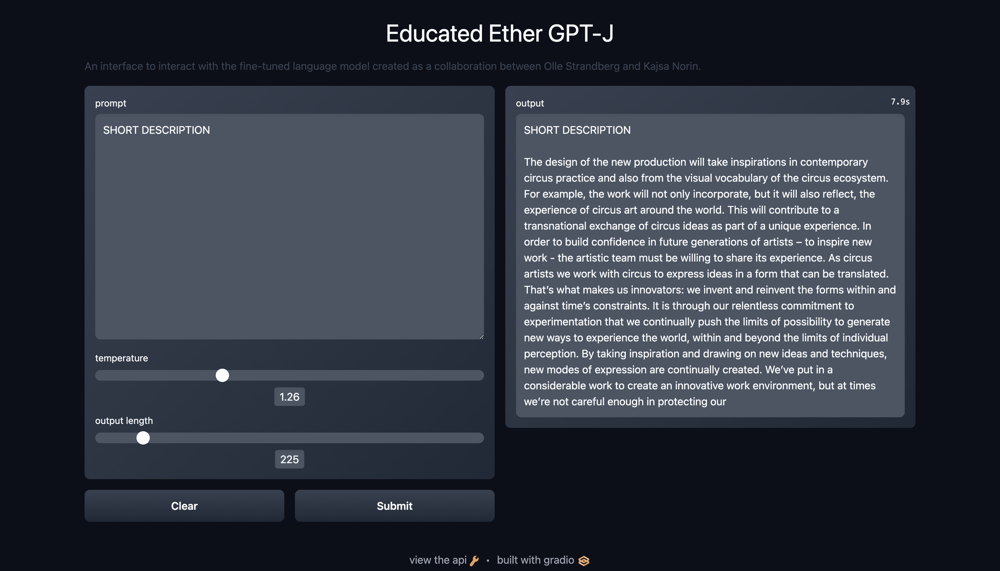

# GPT-J API

This API is a service to run and interact with the finetuned GPT-J 6b language model developed in the Educated Ether project. The service runs entirely in Docker and has support for both CPU and GPU, although running it on a CPU is painfully slow.

It consists of two parts, a backend API to run inference on the language model and a backend-for-frontend (bff) build in Gradio for running the interface to interact with the model. Both parts are run as separate Docker containers.

## Running the API
The backend API will look for a GPT model in `/home/kajsa.norin/models/hf_weights`. To run this locally you will have to reconfigure the Makefile so that the volume points to a valid directory, where a GPT model is placed. The API runs on port 8001 in a Docker container called `gpt-j`, and has only one endpoint `/generate_new_paragraph`.

The bff then queries `/generate_new_paragraph` with the user prompt.

### Make commands
- `make build` builds the Docker container on a CPU
- `make build-gpu` builds the Docker container on a GPU
- `make run` runs the container on a CPU
- `make run-gpu` runs the container on a GPU
- `make stop` stops the container, on both CPU and GPU.

You can run `docker logs gpt-j` and `docker logs bff` to read the logs from the container and `docker ps` to see the current processes.

## Hosted solution
The API is hosted on Google Cloud in a VM instance with a V100 GPU attached, which gives an inference time between 2 to 10 seconds depending on sequence length. You can ssh into the instance with ssh username@ipadress given the correct ssh key. You can check if the GPU is running correctly with the command `nvidia-smi`, it should show a table with the currently running processes. The Nvidia drivers sometimes need reinstalling, you can do this by running `sudo /opt/deeplearning/install-driver.sh` on the instance.
